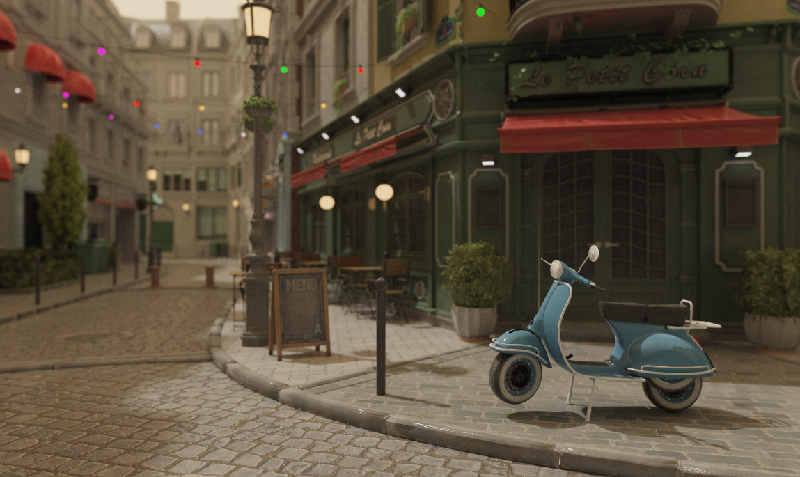

# VexEngine

A C++ rendering engine with an interactive editor, supporting both real-time rasterization and path tracing.


*Scene: Nvidia [Amazon Lumberyard Bistro](https://developer.nvidia.com/orca/amazon-lumberyard-bistro) (CC-BY 4.0)*

## Features

**Rasterizer**
- Cook-Torrance GGX BRDF (microfacet PBR)
- Normal, roughness, metallic, and emissive texture maps
- Image-based lighting: ambient from average env colour + equirectangular specular reflection
- Directional sun light and point light
- Directional shadow mapping: 4096×4096 depth pass, PCF 3×3, normal-offset + RPDB bias
- Wireframe, depth, normal, UV, albedo, and material-ID debug views
- Mouse picking and selection outline

**Path Tracer**
- Unidirectional path tracing with iterative bounces and Russian roulette termination
- Next-event estimation (NEE) with MIS for all light types
- Emissive area lights with CDF-weighted triangle sampling
- Directional sun light with configurable angular radius (soft shadows)
- Environment map importance sampling (marginal + conditional CDF)
- Cook-Torrance GGX BRDF with full PBR material support (diffuse, mirror, dielectric)
- VNDF specular sampling (Heitz 2018)
- Volumetric participating media: AABB or infinite volumes, Beer-Lambert transmittance, Henyey-Greenstein phase function, scatter color and anisotropy
- Depth-of-field (thin-lens, aperture and focus distance)
- Anti-aliasing via per-sample jitter, firefly clamping
- Progressive accumulation with automatic reset on camera, scene, or settings change

**Post-Processing** (all render modes)
- HDR pipeline with exposure, ACES tonemapping, and gamma correction
- Bloom: threshold → separable Gaussian blur → HDR composite
- OIDN denoising (Intel Open Image Denoise, path tracer only)

Implemented three ways:
- **CPU** — multithreaded, SAH BVH acceleration
- **GPU (OpenGL)** — compute shader, same BVH uploaded to GPU
- **GPU (Vulkan)** — hardware ray tracing (`VK_KHR_ray_tracing_pipeline`), BLAS/TLAS acceleration structures, alpha-clipped geometry via any-hit shader

**Editor**
- ImGui-based UI: scene hierarchy, material editor, light controls, environment maps, volume manager
- Viewport gizmos for translate, rotate, and scale (W / E / R)
- Live switching between all three render modes
- Save rendered image to PNG
- Timestamped log output for performance tracking

## Requirements

- CMake 3.16+
- Visual Studio 2022 (Windows)
- OpenGL 4.3+ capable GPU (primary backend)
- Vulkan 1.2+ GPU with ray tracing support (for the Vulkan backend)

## Building

All dependencies are included as Git submodules. After cloning:

```sh
git submodule update --init --recursive
```

Then configure and build using CMake presets:

```sh
# OpenGL (recommended)
cmake --preset opengl-release
cmake --build build-gl --config Release

# Vulkan
cmake --preset vulkan-release
cmake --build build-vk --config Release
```

Or open the root `CMakeLists.txt` directly in Visual Studio 2022, which will pick up the presets automatically.

The executable is placed in `build-gl/bin/` (or `build-vk/bin/`). It must be run from the repository root so that the `assets/` and `shaders/` directories are on the working-path.

## Project Structure

```
app/          Editor application and scene renderer
engine/       Backend-agnostic core (mesh, texture, raytracer, BVH, log)
backends/     OpenGL and Vulkan backend implementations
shaders/      GLSL shader source
assets/       Meshes, textures, and HDR environment maps
external/     Third-party dependencies (GLFW, GLM, ImGui, stb, GLAD, ...)
cmake/        CMake helper modules
```
