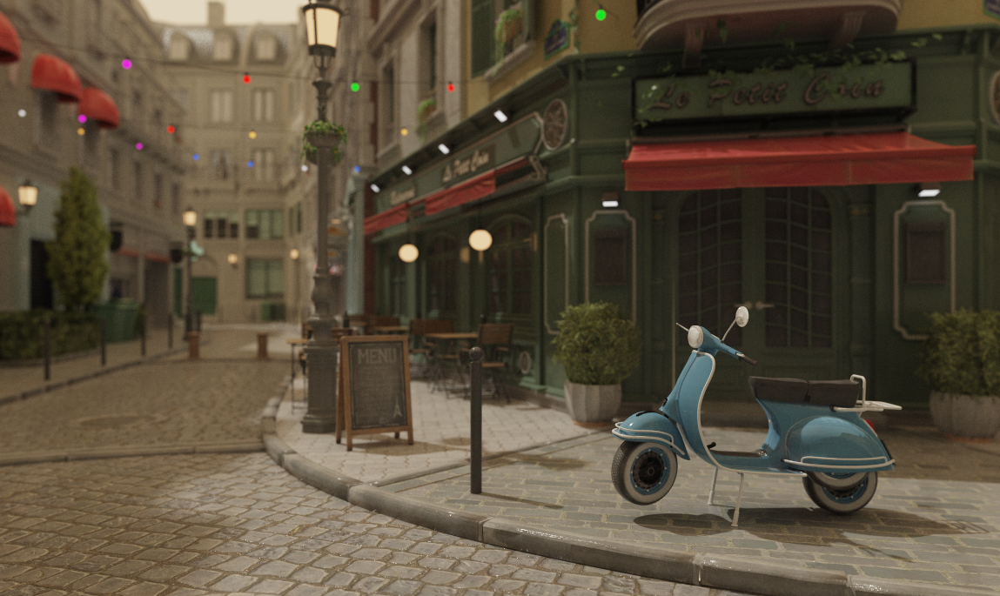

# VexEngine

A C++ rendering engine with an interactive editor, supporting both real-time rasterization and path tracing.


*Scene: Nvidia [Amazon Lumberyard Bistro](https://developer.nvidia.com/orca/amazon-lumberyard-bistro) (CC-BY 4.0)* rendered with VexEngine

## Features

**Rasterizer**
- Cook-Torrance GGX BRDF (microfacet PBR)
- Normal, roughness, metallic, and emissive texture maps
- Image-based lighting: ambient from average env colour + equirectangular specular reflection
- Directional sun light and point light
- Directional shadow mapping: 4096×4096 depth pass, PCF 3×3, normal-offset + RPDB bias
- Wireframe, depth, normal, UV, albedo, and material-ID debug views
- Mouse picking and selection outline

**Path Tracer**
- Unidirectional path tracing with iterative bounces and Russian roulette termination
- Next-event estimation (NEE) with MIS for all light types
- Emissive area lights with CDF-weighted triangle sampling
- Directional sun light with configurable angular radius (soft shadows)
- Environment map importance sampling (marginal + conditional CDF)
- Cook-Torrance GGX BRDF with full PBR material support (diffuse, mirror, dielectric)
- VNDF specular sampling (Heitz 2018)
- Volumetric participating media: AABB or infinite volumes, Beer-Lambert transmittance, Henyey-Greenstein phase function, scatter color and anisotropy
- Depth-of-field (thin-lens, aperture and focus distance)
- Anti-aliasing via per-sample jitter, firefly clamping
- Progressive accumulation with automatic reset on camera, scene, or settings change

**Post-Processing** (all render modes)
- HDR pipeline with exposure, ACES tonemapping, and gamma correction
- Bloom: threshold → separable Gaussian blur → HDR composite
- OIDN denoising (Intel Open Image Denoise, path tracer only)

Implemented four ways:
- **CPU** — multithreaded, SAH BVH acceleration
- **GPU (OpenGL, Compute)** — compute shader, same BVH uploaded to GPU
- **GPU (Vulkan, Compute)** — compute shader path tracer, software BVH on GPU
- **GPU (Vulkan, HW RT)** — hardware ray tracing (`VK_KHR_ray_tracing_pipeline`), BLAS/TLAS acceleration structures, alpha-clipped geometry via any-hit shader

**Editor**
- ImGui-based UI: scene hierarchy, material editor, light controls, environment maps, volume manager
- Viewport gizmos for translate, rotate, and scale (W / E / R)
- Live switching between all render modes
- Save rendered image to PNG
- Timestamped log output for performance tracking

## Performance

Measured with the built-in benchmark mode (`--bench <config.json>`). Every
number below is reproducible with the exact command shown for that row.
Configs live in `bench/`. Each run writes `frames.csv`, `summary.csv`,
`final.png`, and a `run.json` (GPU name, driver-reported device string, git
commit) to `results/<name>/`.

Scene: ChessSet (76,920 triangles, 33 submeshes), 1920x1080, VSync off.
GPU: NVIDIA GeForce RTX 4070 Ti. `mean`/`p95`/`p99` are computed over the
measured frames only (warmup frames excluded), per `bench/*.json`'s
`warmupFrames`/`measureFrames`.

`gpu_raytrace` is a different code path on each backend: hardware ray
tracing (`VK_KHR_ray_tracing_pipeline`) on Vulkan, a software-BVH compute
shader on OpenGL. They are labelled "HW RT" and "compute" below so they are
never read as the same algorithm. `compute_raytrace` (a second, separate
software path tracer) is Vulkan-only by design and has no bench config in
`bench/`; its row was measured with an ad hoc copy of
`chessset-gpurt-1080p.json` with `"mode"` changed to `"compute_raytrace"`,
reproduced inline below since nothing under `bench/` runs it.

| Mode | Backend | Metric | mean (ms) | p95 (ms) | p99 (ms) | Command |
|---|---|---|---|---|---|---|
| Rasterize | Vulkan | frame_gpu | 0.141 | 0.166 | 0.167 | `vex_app --bench bench/chessset-raster-1080p.json` |
| Rasterize | OpenGL | frame_gpu | 0.161 | 0.164 | 0.165 | `vex_app --bench bench/chessset-raster-1080p.json` |
| Path trace (HW RT) | Vulkan | frame_gpu | 0.252 | 0.262 | 0.280 | `vex_app --bench bench/chessset-gpurt-1080p.json` |
| Path trace (compute) | Vulkan | frame_gpu | 0.912 | 1.037 | 1.072 | copy of `chessset-gpurt-1080p.json` with `"mode": "compute_raytrace"` |
| Path trace (compute) | OpenGL | frame_gpu | 22.865 | 22.865 | 22.865 | `vex_app --bench bench/chessset-gpurt-1080p.json` |
| Path trace (CPU) | Vulkan | frame_cpu | 115.011 | 128.160 | 134.576 | `vex_app --bench bench/chessset-cpurt-1080p.json` |
| Path trace (CPU) | OpenGL | frame_cpu | 105.275 | 115.314 | 121.900 | `vex_app --bench bench/chessset-cpurt-1080p.json` |

Notes on the metric column: `frame_gpu` (GPU-side wall time for the whole
frame) is the meaningful cost for GPU-bound modes. The CPU path tracer is
CPU-bound (`CPU PT: trace` alone averages ~90 ms), so `frame_cpu` is quoted
for those two rows instead; their `frame_gpu` mostly reflects the cost of
uploading the traced image and compositing it (2.3 ms on Vulkan, 14.9 ms on
OpenGL, driven by `CPU PT: upload`), not ray tracing itself.

The OpenGL "Path trace (compute)" row is real, measured data, but every one
of its 300 measured frames returned the *same* value for both `frame_gpu`
and `frame_cpu` (`summary.csv` shows `stddev = 0.0000`), reproducible
across separate runs (a second run measured 22.090 ms flat instead of
22.865 ms). This is a real property of this configuration, not a copy-paste
error: the shipped config's camera orbits continuously, so
`GPURaytraceMode` resets the progressive accumulator on every single frame
(`changes.cameraChanged`), which means the compute shader always performs
exactly one full, fixed-cost dispatch per frame with no content-dependent
early-out. Combined with the profiler's query-ring behaviour (a slot whose
query is not yet available reuses the previous resolved result rather than
blocking), the reported timing is unusually stable for this specific
mode/backend/camera-path combination. Treat this row's `p95`/`p99` as
equal to its mean by construction, not as evidence of zero jitter.

`chessset-gpurt-converge.json` measures convergence (static camera,
`maxSamples: 512`) rather than throughput and is not part of the table
above; running it produced `frame_gpu` mean 0.378 ms, p95 0.493 ms, p99
0.555 ms on Vulkan HW RT, consistent with the throughput row once the
accumulator is allowed to build up: `RT dispatch` cost is unaffected by
`maxSamples` since each dispatch still traces one sample, but `frame_cpu`
drops to 0.024 ms mean because the camera never triggers an accumulator
reset.

Per-pass breakdown for the Vulkan rasterizer (`chessset-raster-1080p.json`
on Vulkan), derived from that run's `summary.csv`. This is the same data
the Profiler window's "Copy as Markdown" button would export, reformatted
by hand: the button requires clicking inside the live interactive editor,
which cannot be automated headlessly in the environment these numbers were
generated in, so `mean`/`max` are the run's statistics rather than the
window's live EMA/running-peak.

| Pass | GPU mean (ms) | GPU max (ms) | CPU mean (ms) | CPU max (ms) | % of frame GPU |
|---|---|---|---|---|---|
| Frame | 0.141 | 0.172 | 0.028 | 0.113 | 100 |
| Outline mask | 0.003 | 0.003 | 0.004 | 0.032 | 2 |
| Frame changes | - | - | 0.001 | 0.006 | - |
| Raster: meshes | 0.112 | 0.139 | 0.015 | 0.075 | 79 |
| Composite | 0.019 | 0.022 | 0.003 | 0.009 | 13 |

The child rows do not sum to the frame total (2% + 79% + 13% = 94%, not
100%): zone begin timestamps are recorded at `TOP_OF_PIPE` and end
timestamps at `BOTTOM_OF_PIPE`, so a zone's measured GPU time can absorb
or miss time from work still draining ahead of it in the pipeline. Treat
the per-pass numbers as directionally accurate, not as an exact partition
of the frame.

## Requirements

- CMake 3.16+
- Visual Studio 2022 (Windows)
- OpenGL 4.3+ capable GPU (primary backend)
- Vulkan 1.2+ GPU with ray tracing support (for the Vulkan backend)

## Building

All dependencies are included as Git submodules. After cloning:

```sh
git submodule update --init --recursive
```

Then configure and build using CMake presets:

```sh
# OpenGL (less overhead)
cmake --preset opengl-release
cmake --build build-gl --config Release

# Vulkan (compute path tracer + hardware ray tracing)
cmake --preset vulkan-release
cmake --build build-vk --config Release
```

Or open the root `CMakeLists.txt` directly in Visual Studio 2022, which will pick up the presets automatically.

The executable is placed in `build-gl/bin/` (or `build-vk/bin/`). It must be run from the repository root so that the `assets/` and `shaders/` directories are on the working-path.

## Project Structure

```
app/          Editor application and scene renderer
engine/       Backend-agnostic core (mesh, texture, raytracer, BVH, log)
backends/     OpenGL and Vulkan backend implementations
shaders/      GLSL shader source
assets/       Meshes, textures, and HDR environment maps
external/     Third-party dependencies (GLFW, GLM, ImGui, stb, GLAD, ...)
cmake/        CMake helper modules
```
